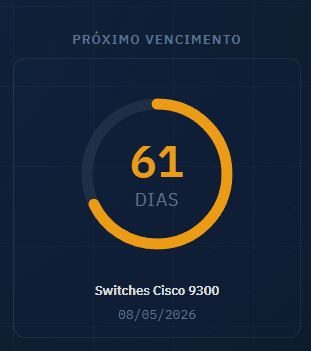

# Key O'Clock

> **Because expired licenses don't warn you — they just stop your business cold.**

Key O'Clock is your command center for software asset and license management. No more lost Excel spreadsheets, sticky notes on the monitor, or that gut-drop feeling when a critical application stops working because someone forgot to renew the contract.


---

## Latest Release: v1.0 (Production Ready)

We are officially production-ready! Key O'Clock version v1.0 consolidates the security and stability foundation necessary for the corporate environment.

---

## Why use it?

| | |
|---|---|
| **Full Visibility** | Know exactly what you have, where it is, and what it costs. |
| **Zero Surprises** | Visual and email alerts that warn you well before deadlines hit. |
| **Executive Reporting** | Export board-ready data in seconds. |
| **Privacy Taken Seriously** | Bank-grade encryption for your sensitive data. |

---

## What it does for you

### Smart Inventory
Organize everything in a tree structure **(Group → List → Item)**. As intuitive as a file folder, but with the power of a database. Accidentally deleted something? Soft delete keeps your data in "quarantine" before it's gone for good.

### Health Traffic Light (Automatic Status)
The system works for you, classifying your licenses in real time:

| | |
|---|---|
| 🟣 **Expired** | You have a problem right now. |
| 🔴 **Critical** (≤30 days) | Time to open the procurement process. |
| 🟠 **Attention / Soon** (≤60 days) | On your radar, no rush yet. |
| 🟢 **Valid / Perpetual**  (>90 days)| Sleep easy. |

### Executive Dashboard & Stylish Widgets
It's not just functional — it's good-looking. Track your software portfolio health with clear charts and our famous **Next Expiration Widget**.

Pick your style: From the classic **Odometer** to the retro **Digital** (Casio-style), or even an **Hourglass** for the dramatic ones. 9 styles in total.



### The "Virtual Assistant" That Never Sleeps
Key O'Clock sends automated reports and alerts straight to your inbox:

- **Scheduled Reports** — A full PDF in your email every X days.
- **Daily Pulse** — "Hey, these 3 licenses go critical today."
- **Expiration Reminders** — So you don't forget to clean up what's already past.

---

## Quick Start

### Download & Install

Download the latest release:

**Download the installer:** (https://github.com/solopx/keyoclock/releases/download/v1.0.0-Windows/KeyOClock-Setup-v1.0.exe)


Or if you prefer, you can clone the repository and run it locally.

If you already have Python installed, you're 3 commands away:

```bash
# 1. Set up the environment
pip install -r requirements.txt

# 2. Run it (HTTP mode)
python app.py

# 3. Want maximum security? (HTTPS mode)
start_https.bat          # Windows
HTTPS_MODE=1 python app.py  # Linux
```

Default access: `http://localhost:5000` | User: `admin` | Password: `admin`

> Password change is mandatory on first login!

---

## Security & Privacy

Key O'Clock uses **Fernet (AES-128 + HMAC-SHA256)** to protect sensitive fields like contracts and SMTP passwords. The key is configured under **Settings → Database → Encryption**.

> **⚠ Responsibility notice:**
> The encryption key belongs to **you**. If you lose it, not even NASA can recover the data.
> Guard your `.enc_key` file like gold — and always back it up alongside `keyoclock.db`.

---

## Make It Yours

Every user has their own taste. That's why we offer:

- **7 Themes** — including the nostalgic Windows XP and the sleek Midnight.
- **9 Widget Styles** — Ring, Arc, Bar, Minimal, Digital, Classic, Hourglass, Odometer, Flip.
- **3 Font Sizes** — all saved locally, no need to reconfigure each session.

---

## For Devs

### Project structure

```
keyoclock/
├── app.py
├── run.py
│
├── database/
│   ├── db.py
│   ├── auth.py
│   ├── helpers.py
│   ├── certs.py
│   ├── ratelimit.py
│   ├── scheduler.py
│   └── email_utils.py
│
├── routes/
│   ├── auth.py
│   ├── views.py
│   ├── api_stats.py
│   ├── api_inventory.py
│   ├── api_licenses.py
│   ├── api_reports.py
│   ├── api_users.py
│   ├── api_certificates.py
│   ├── api_email.py
│   ├── api_database.py
│   ├── api_audit.py
│   └── api_schedule.py
│
├── templates/
│   ├── app.html
│   └── login.html
│
├── static/
│   ├── css/app.css
│   ├── fonts/
│   ├── images/
│   └── js/
│       ├── app.js, api.js, theme.js, ui.utils.js
│       ├── ui.dashboard.js, ui.inventory.js, ui.licenses.js
│       ├── ui.reports.js, ui.contracts.js, ui.admin.js
│       ├── ui.certificates.js, ui.email.js, ui.database.js
│       ├── ui.schedule.js, ui.audit.js
│
├── docs/
└── requirements.txt
```

### Environment variables

| Variable | Default | Description |
|----------|---------|-------------|
| `KEYOCLOCK_DATA_DIR` | `./instance/` | Data directory (database, keys, certs, logs) |
| `SECRET_KEY` | auto-generated | Flask session secret key |
| `HTTPS_MODE` | unset | Enables HTTPS mode with cheroot + TLS |
| `PORT` | `5000` | Server port |
| `HOST` | `0.0.0.0` | Listening interface |
| `DISABLE_SCHEDULER` | unset | `'1'` disables APScheduler (required with gunicorn `-w N`) |

```bash
# Linux production setup
export SECRET_KEY="$(python3 -c 'import secrets; print(secrets.token_hex(32))')"
export KEYOCLOCK_DATA_DIR=/var/lib/keyoclock
export HTTPS_MODE=1
python app.py
```

> **Multiple workers (gunicorn -w N):** set `DISABLE_SCHEDULER=1` on all workers — otherwise each worker fires its own scheduled jobs and emails arrive duplicated N times.

### Tech stack

| Layer | Technology |
|-------|-----------|
| Backend | Python 3.11+, Flask 3, Werkzeug |
| Database | SQLite (WAL mode, no ORM) |
| HTTPS Server | cheroot + BuiltinSSLAdapter |
| Scheduling | APScheduler 3 (BackgroundScheduler) |
| Exports | openpyxl (XLSX), reportlab (PDF) |
| Encryption | cryptography — Fernet AES-128, PBKDF2-SHA256 |
| Frontend | Vanilla JS (SPA), CSS custom properties |
| Typography | IBM Plex Sans + IBM Plex Mono (self-hosted) |
