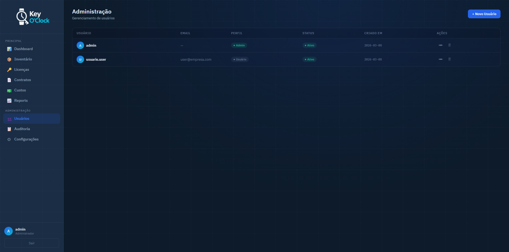
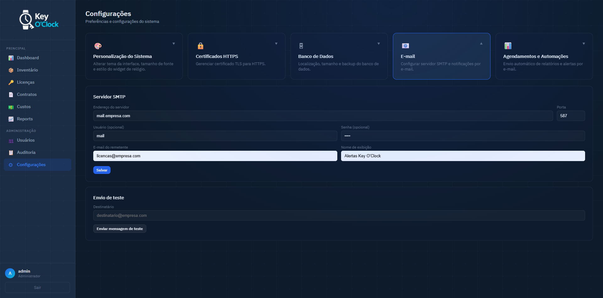
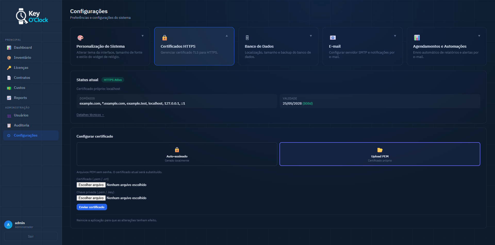
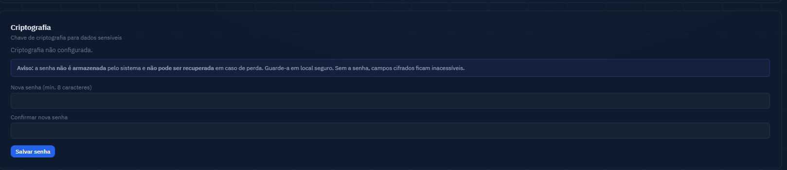
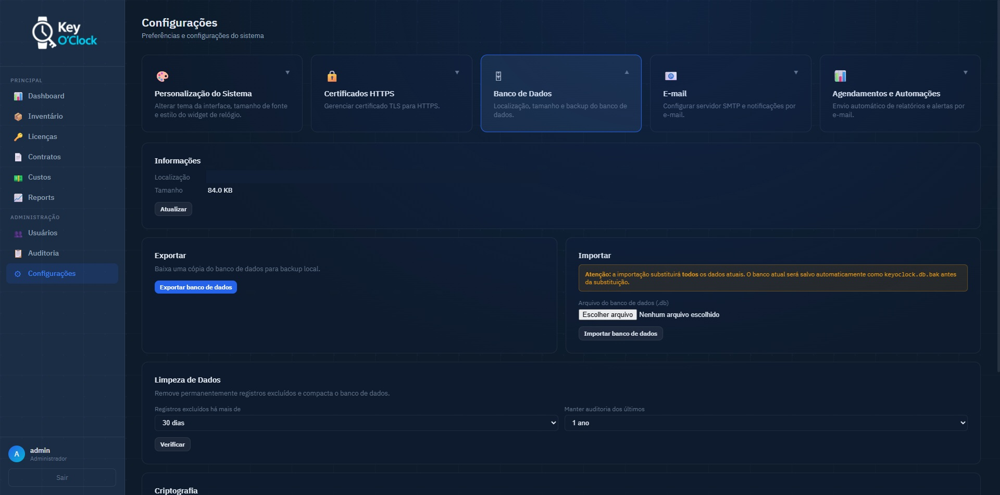

# Administração

← [Personalização](./personalizacao.md) | [Voltar ao índice](./index.md) | [Arquitetura →](./arquitetura.md)

> As funcionalidades desta seção são exclusivas para usuários com perfil **admin**.

---

## Gerenciamento de Usuários

Acesse **Configurações → Usuários** (ícone de usuário no menu lateral, visível apenas para admins).


*Lista de usuários com opções de edição e exclusão*

**Criar um novo usuário:**
1. Clique em **+ Novo Usuário**
2. Preencha: nome de usuário, e-mail (opcional), senha e perfil (Admin ou Usuário)
3. Clique em **Salvar**

**Editar um usuário:**
1. Clique no ícone de edição (✏) ao lado do usuário
2. Altere os campos desejados — deixe a senha em branco para mantê-la
3. Clique em **Salvar**

**Excluir um usuário:**
1. Clique no ícone de exclusão (🗑) ao lado do usuário
2. Confirme a exclusão

**Perfis:**

| Perfil | Permissões |
|--------|-----------|
| **Admin** | Acesso total, incluindo configurações de sistema |
| **Usuário** | Acesso ao inventário, licenças, relatórios e auditoria — sem configurações de sistema |

---

## Configuração de E-mail SMTP

Acesse **Configurações → E-mail**.


*Formulário de configuração do servidor SMTP*

**Campos:**

| Campo | Descrição |
|-------|-----------|
| Servidor SMTP | Endereço do servidor (ex: `smtp.gmail.com`) |
| Porta | 465 (SSL), 587 (STARTTLS) ou 25 (SMTP simples) |
| Usuário | Endereço de e-mail da conta de envio |
| Senha | Senha da conta (armazenada criptografada se a criptografia estiver ativa) |
| Remetente | Endereço que aparece no campo "De:" |
| Nome exibido | Nome que aparece junto ao remetente |

Após preencher, clique em **Testar Envio** para validar a configuração antes de salvar.

---

## Certificados HTTPS

Acesse **Configurações → Certificados HTTPS**.


*Opções de gerenciamento de certificado TLS*

**Opção 1 — Gerar certificado auto-assinado:**
1. Clique em **Gerar novo certificado**
2. O certificado é criado automaticamente e salvo em `$KEYOCLOCK_DATA_DIR/certs/`
3. Reinicie o serviço para aplicar

**Opção 2 — Fazer upload de certificado próprio:**
1. Selecione **Upload de certificado PEM**
2. Envie o arquivo do certificado (`.pem` ou `.crt`) e o arquivo da chave privada (`.pem` ou `.key`)
3. A chave privada **não pode ter senha** (sem passphrase) — chaves protegidas com senha são rejeitadas
4. Os arquivos são validados e salvos imediatamente
5. **Reinicie o serviço** para que o novo certificado entre em vigor: `net stop KeyOClock` → `net start KeyOClock`

> Certificados auto-assinados geram um aviso de segurança no navegador. Para uso em rede corporativa sem aviso, utilize um certificado emitido por uma CA interna ou por uma CA confiável como Let's Encrypt.

Consulte o [Guia de Certificados](./certificados.md) para instruções detalhadas sobre como obter e importar certificados.

---

## Criptografia de Campos

Acesse **Configurações → Banco de Dados → Criptografia**.


*Status e configuração da criptografia de campos*

A criptografia protege dados sensíveis no banco com **Fernet (AES-128-CBC + HMAC-SHA256)**. Campos protegidos: contrato das licenças e senha SMTP.

**Ativar pela primeira vez:**
1. Defina uma senha forte (mínimo 12 caracteres recomendado)
2. Clique em **Configurar Criptografia**
3. A chave é derivada da senha e salva em `$KEYOCLOCK_DATA_DIR/.enc_key` — acesso ao arquivo deve ser restrito ao usuário do serviço (ACL/permissões de SO)
4. Os dados existentes são criptografados automaticamente

> ### ⚠ Leia antes de ativar
>
> - A chave **não fica no banco de dados** — fica no arquivo `.enc_key` separado
> - Se esse arquivo for perdido ou o servidor migrado sem copiá-lo, os dados criptografados se tornam **irrecuperáveis**
> - **Não existe mecanismo de recuperação** — guarde a senha em um gerenciador de senhas corporativo
> - **Faça backup do arquivo `.enc_key` junto com o banco `keyoclock.db`** — trate ambos como dados confidenciais

**Trocar a senha:**
1. Informe a senha atual e a nova senha
2. Clique em **Alterar Senha** — a chave é re-derivada e o arquivo `.enc_key` é atualizado

---

## Exportação e Importação do Banco

Acesse **Configurações → Banco de Dados**.


*Informações do banco, exportação, importação e limpeza de dados*

**Exportar:**
1. Clique em **Exportar banco de dados**
2. O arquivo `keyoclock.db` é baixado pelo navegador
3. Guarde em local seguro — contém todos os dados da aplicação

**Importar:**
1. Clique em **Importar banco de dados**
2. Selecione um arquivo `.db` previamente exportado
3. Confirme — o banco atual é substituído pelo importado

> A importação substitui todos os dados. Faça um backup antes de importar.

---

## Limpeza de Dados (Purge)

Acesse **Configurações → Banco de Dados → Limpeza de Dados**.

Registros excluídos (soft delete) ficam no banco com a data de exclusão marcada. O purge remove permanentemente esses registros após a carência configurada e compacta o banco (VACUUM).

**Configurar e executar:**
1. Selecione a **carência em dias** (ex: 30 dias — registros excluídos há mais de 30 dias serão removidos)
2. Selecione a **rotação do log de auditoria** (ex: manter somente os últimos 90 dias)
3. Clique em **Pré-visualizar** para ver o que será removido
4. Clique em **Executar Limpeza** para confirmar

> A limpeza é **irreversível**. Registros removidos pelo purge não podem ser recuperados.

---

## Controle do Serviço Windows

Para controle manual do serviço após a instalação:

```cmd
net start KeyOClock
net stop  KeyOClock
```

Ou via **Painel de Controle → Ferramentas Administrativas → Serviços → KeyOClock**.

O serviço é configurado para **iniciar automaticamente com o Windows** e **reiniciar automaticamente** em caso de falha (3 tentativas: 5s, 15s, 30s).

---

← [Personalização](./personalizacao.md) | [Voltar ao índice](./index.md) | [Arquitetura →](./arquitetura.md)
