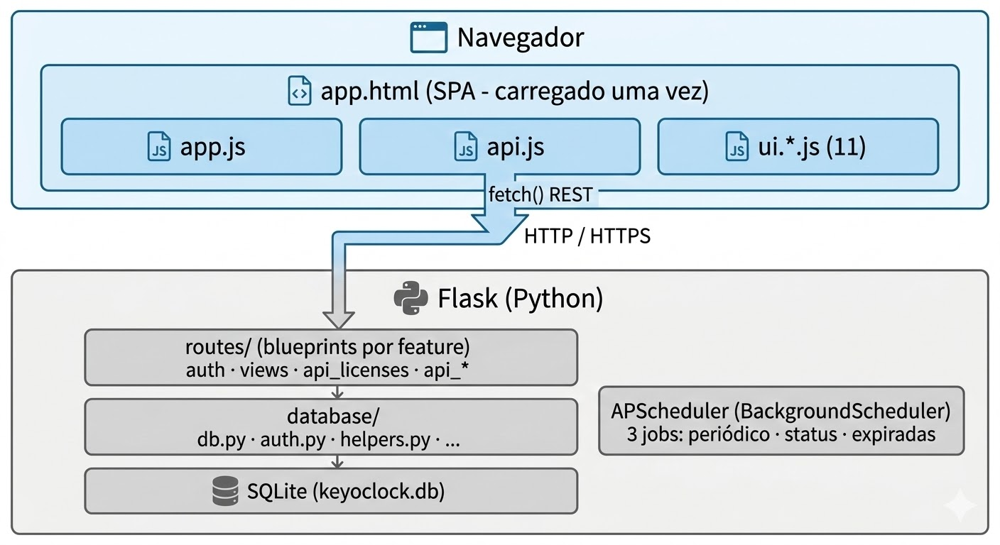

# Arquitetura

← [Administração](./administracao.md) | [Voltar ao índice](./index.md)

---

## Visão Geral

Key O'Clock é uma **Single Page Application (SPA)** servida por Flask. O servidor entrega o HTML uma única vez; todas as interações subsequentes são chamadas de API REST via `fetch()` em JavaScript.

```
┌─────────────────────────────────────────────────┐
│                   Navegador                     │
│                                                 │
│  ┌──────────────────────────────────────────┐   │
│  │  app.html  (SPA — carregado uma vez)     │   │
│  │  ┌────────┐ ┌────────┐ ┌─────────────┐   │   │
│  │  │ app.js │ │ api.js │ │ ui.*.js (11)│   │   │
│  │  └────────┘ └────────┘ └─────────────┘   │   │
│  └────────────────────┬─────────────────────┘   │
│                       │ fetch() REST            │
└───────────────────────┼─────────────────────────┘
                        │ HTTP / HTTPS
┌───────────────────────┼─────────────────────────┐
│                  Flask (Python)│                │
│                       │                         │
│  ┌──────────────────────────────────────────┐   │
│  │  routes/  (blueprints por feature)       │   │
│  │  auth · views · api_licenses · api_*     │   │
│  └──────────────┬───────────────────────────┘   │
│                 │                               │
│  ┌──────────────┼───────────────────────────┐   │
│  │  database/   │                           │   │
│  │  db.py · auth.py · helpers.py · ...      │   │
│  └──────────────┼───────────────────────────┘   │
│                 │                               │
│  ┌──────────────▼───────────────────────────┐   │
│  │  SQLite (keyoclock.db)                   │   │
│  └──────────────────────────────────────────┘   │
│                                                 │
│  ┌───────────────────────────────────────────┐  │
│  │  APScheduler (BackgroundScheduler)        │  │
│  │  3 jobs: periódico · status · expiradas   │  │
│  └───────────────────────────────────────────┘  │
└─────────────────────────────────────────────────┘
```


*Diagrama de camadas da aplicação*

---

## Navegação SPA

A navegação entre páginas **não recarrega o servidor**. O JavaScript controla qual seção é exibida:

1. O usuário clica em um item do menu lateral
2. `showPage('licenses')` é chamado em `app.js`
3. A função oculta todas as páginas e exibe somente a selecionada
4. O handler da página (`loadLicenses()`) faz `fetch('/api/licenses')` e renderiza os dados

Resultado: navegação instantânea sem flicker de tela.

---

## Estrutura de Arquivos

```
app.py                      ← Ponto de entrada: Flask factory, blueprints, scheduler, HTTPS
run.py                      ← Atalho para executar de qualquer diretório

database/
  db.py                     ← SQLite helpers, schema, migrações, criptografia Fernet
  auth.py                   ← @login_required, @admin_required (decoradores)
  helpers.py                ← lic_status(), format_date_br(), validate_input()
  certs.py                  ← Geração e leitura de certificados TLS auto-assinados
  ratelimit.py              ← Sliding window rate limiter em memória
  scheduler.py              ← 3 jobs de e-mail agendados
  email_utils.py            ← send_email() via SMTP com suporte a anexo PDF

routes/
  auth.py                   ← POST /login, GET /logout
  views.py                  ← GET / — entrega o app.html com cache-busting
  api_stats.py              ← GET /api/stats
  api_inventory.py          ← CRUD /api/divisions, /api/lists, /api/items
  api_licenses.py           ← CRUD /api/licenses
  api_contracts.py          ← GET /api/contracts (agrupamento Python pós-decrypt)
  api_reports.py            ← GET /api/reports/data, exportação XLSX e PDF
  api_users.py              ← CRUD /api/users (admin)
  api_certificates.py       ← GET/POST /api/certificates
  api_email.py              ← GET/POST /api/email/config, POST /api/email/test
  api_database.py           ← export, import, purge, criptografia
  api_audit.py              ← GET /api/audit
  api_schedule.py           ← GET/POST /api/schedule/config

templates/
  app.html                  ← SPA: layout, navegação, modais
  login.html                ← Página de login standalone

static/
  css/app.css               ← CSS unificado: variáveis, 7 temas, layout, componentes
  fonts/                    ← IBM Plex Sans + IBM Plex Mono (self-hosted)
  images/                   ← Logo
  js/
    app.js                  ← Estado global (state), showPage(), navegação
    api.js                  ← Wrapper fetch() com toasts de erro/sucesso
    theme.js                ← Temas, estilos de widget, tamanho de fonte
    ui.utils.js             ← escapeHTML(), openModal/closeModal
    ui.dashboard.js         ← Cards executivos, status bar, widget de vencimento (9 estilos SVG)
    ui.inventory.js         ← Árvore grupo→lista→item
    ui.licenses.js          ← Painel de licenças, filtros, paginação (50/pág), modal
    ui.contracts.js         ← Página de contratos expansíveis
    ui.reports.js           ← Relatórios, gráficos, paginação, exportação
    ui.admin.js             ← Gerenciamento de usuários
    ui.certificates.js      ← Gerenciamento de certificados TLS
    ui.email.js             ← Configuração SMTP
    ui.database.js          ← Banco: export, import, purge, criptografia
    ui.schedule.js          ← Configuração de agendamentos
    ui.audit.js             ← Visualização do log de auditoria
```

---

## Banco de Dados

SQLite em `$KEYOCLOCK_DATA_DIR/keyoclock.db`. Sem ORM — queries diretas com helpers internos:

| Helper | Retorno | Uso |
|--------|---------|-----|
| select múltiplas linhas | `list[dict]` | leituras de coleções |
| select uma linha | `dict \| None` | leituras de registro único |
| execute | `lastrowid` | INSERT/UPDATE/DELETE |
| log de auditoria | — | grava ação no audit_log |

**Hierarquia das tabelas:**

```
usuário
  grupo
    lista
      item de inventário
        licença
configurações do sistema  ← chave/valor
log de auditoria
```

**Soft delete:** todas as tabelas principais possuem uma coluna de exclusão lógica. Registros excluídos recebem um timestamp e ficam filtrados em todas as queries. A remoção permanente ocorre via purge manual.

**Migrações incrementais:** a inicialização do banco executa `ALTER TABLE` somente se a coluna ainda não existe — seguro executar em bancos de versões anteriores sem perda de dados.

---

## Criptografia de Campos

Implementada com **Fernet** (`cryptography` lib): AES-128-CBC + HMAC-SHA256.

```
Senha do admin
      │
      ▼ PBKDF2-SHA256 (alta iteração)
  Fernet key
      │
      ├── encrypt_val(key, texto) → "enc:TOKEN_FERNET"
      └── decrypt_val(key, "enc:TOKEN") → texto original
```

A chave derivada é salva em `$KEYOCLOCK_DATA_DIR/.enc_key` (arquivo separado do banco) — acesso deve ser restrito ao usuário do serviço no nível do SO.

**Campos criptografados:**

| Tabela | Campo |
|--------|-------|
| `license` | `contract` |
| `app_config` | `email_password` |

> Campos criptografados não podem ser agrupados diretamente no SQL. O agrupamento de contratos é feito em Python após descriptografar todos os valores.

---

## Rate Limiting do Login

Implementado em memória (sem Redis ou banco externo) com sliding window:

- Estrutura: `dict[ip] → [timestamp, ...]`
- Limite: N tentativas por janela de tempo por IP
- Bloqueio temporário após exceder o limite
- Entradas expiradas são removidas automaticamente a cada verificação

---

## Scheduler de E-mails

`APScheduler BackgroundScheduler` com tick a cada **1 hora**. Os 3 jobs verificam as condições e enviam e-mail se necessário:

| Job | Condição de envio |
|-----|-------------------|
| Periódico | `now - last_sent >= N dias` |
| Status | Há licenças em critical/warning/soon E ainda não enviou hoje |
| Expiradas | `now - last_sent >= N dias` E há licenças expiradas |

Estado de cada job persistido em `app_config` (colunas `sched_*_last_sent`). Em caso de falha SMTP, o timestamp não é atualizado — nova tentativa no próximo tick.

> Em ambientes com múltiplos workers (gunicorn `-w N`), defina `DISABLE_SCHEDULER=1` para evitar disparos duplicados.

---

## Servidor HTTPS

Em modo HTTPS (`HTTPS_MODE=1`), a aplicação usa **cheroot** (thread pool WSGI) com `BuiltinSSLAdapter`, em vez do servidor de desenvolvimento Werkzeug.

| Aspecto | Werkzeug SSL | cheroot |
|---------|-------------|---------|
| Handshakes SSL simultâneos | Serializado (GIL) | Thread pool (10 threads) |
| Resultado | `ERR_TIMED_OUT` com múltiplas abas | Estável |

O certificado TLS é gerado automaticamente pelo módulo `database/certs.py` via `cryptography` lib e armazenado em `$KEYOCLOCK_DATA_DIR/certs/`.

---

← [Administração](./administracao.md) | [Voltar ao índice](./index.md)
