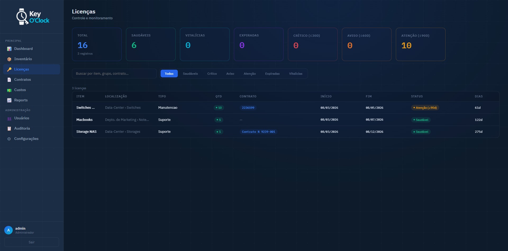
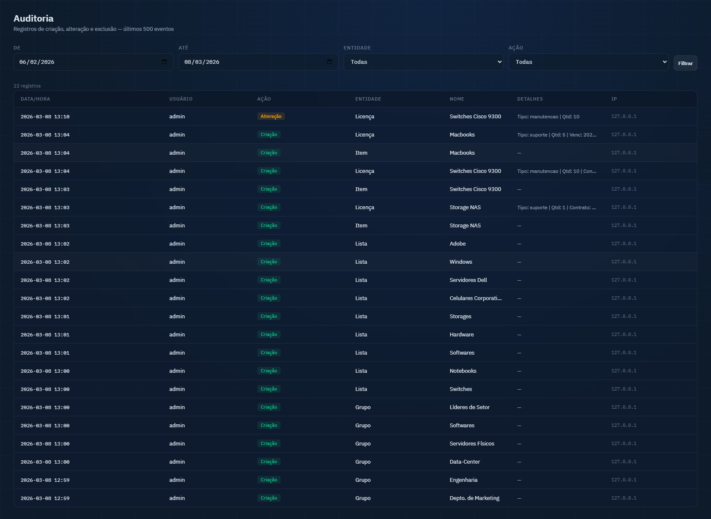

# Funcionalidades

← [Instalação](./instalacao.md) | [Voltar ao índice](./index.md) | [Guia de Operação →](./operacao.md)

---

## Dashboard

Tela inicial após o login. Apresenta uma visão executiva do estado atual de todas as licenças.


*Dashboard com cards executivos, barra de status e widget de próximo vencimento*

**O que é exibido:**

- **Cards executivos** — Total de licenças, grupos ativos e itens no inventário
- **Barra de status** — Contagem de licenças por faixa: Saudáveis · Vitalícias · Aviso (≤90d) · Atenção (≤60d) · Crítico (≤30d) · Expiradas. Cada faixa é clicável e filtra a lista de licenças
- **Tabela de grupos** — Lista os grupos ordenados por criticidade, com badge de status de cada um
- **Widget de próximo vencimento** — Exibe a licença mais próxima do vencimento com contagem regressiva em dias. Disponível em 9 estilos visuais configuráveis pelo usuário

---

## Inventário

Organiza os ativos em uma estrutura hierárquica de três níveis: **Grupo → Lista → Item**.


*Árvore de inventário com grupos, listas e itens*

**Hierarquia:**

```
Grupo
└── Lista
    └── Item (ativo/dispositivo)
        └── Licenças associadas
```

**Grupos são um conceito flexível.** Não há uma estrutura obrigatória — o usuário organiza o inventário da forma que melhor represente sua realidade. Um grupo pode representar qualquer agrupamento lógico ou físico: um departamento, uma filial, um cliente, um projeto, um rack de servidores ou qualquer outra unidade que faça sentido para a empresa. A aplicação não impõe nenhuma hierarquia organizacional, financeira ou técnica — adapta-se à estrutura que o administrador definir.

**Exemplos de uso:**

| Contexto | Grupos | Listas | Itens |
|----------|--------|--------|-------|
| Por departamento | TI, Financeiro, RH | Servidores, Estações | SRV-01, WS-FINANCE-01 |
| Por filial | Matriz, Filial SP, Filial RJ | Infraestrutura, Usuários | hostname / patrimônio |
| Por cliente (MSP) | Cliente A, Cliente B | Servidores, Desktops | Ativos de cada cliente |
| Por projeto | Projeto Alpha, Projeto Beta | Ambientes | dev-server-01, prod-server-01 |

**Funcionalidades:**
- Criação, edição e exclusão de grupos, listas e itens
- Exclusão lógica (soft delete) — registros excluídos ficam em carência antes da remoção permanente
- Contagem de licenças exibida diretamente na árvore por item
- Busca e filtragem por nome em todos os níveis

---

## Licenças

Módulo central da aplicação. Cada licença é associada a um item do inventário.


*Lista de licenças com filtro por status e busca*

**Campos de uma licença:**

| Campo | Descrição |
|-------|-----------|
| Item | Item do inventário ao qual a licença pertence |
| Tipo | Tipo da licença (ex: OEM, Volume, Subscrição) |
| Quantidade | Número de licenças deste registro |
| Contrato | Identificador do contrato (criptografado se habilitado) |
| Data de início | Início da vigência |
| Data de fim | Fim da vigência (vazio = perpétua) |
| Perpétua | Marca a licença como sem vencimento |
| Notas | Informações adicionais |

**Status automático por prazo:**

| Status | Condição | Cor |
|--------|----------|-----|
| Expirada | Data de fim no passado | Roxo |
| Crítico | Vence em até 30 dias | Vermelho |
| Atenção | Vence em até 60 dias | Laranja |
| Aviso | Vence em até 90 dias | Amarelo |
| Válida | Vence em mais de 90 dias | Verde |
| Perpétua | Sem data de vencimento | Ciano |

---

## Contratos

Agrupa licenças pelo campo **Contrato**, permitindo visualizar todos os itens associados a um mesmo contrato.


*Página de contratos com linhas expansíveis por contrato*

**Funcionalidades:**
- Listagem de todos os contratos com contagem de registros e quantidade total
- Linhas expansíveis — clique no contrato para ver os itens associados
- Filtro por nome de contrato
- Licenças sem contrato agrupadas em "(Sem contrato)"

> O campo contrato é criptografado com Fernet quando a criptografia está ativa. O agrupamento é feito em Python após descriptografar os valores (não é possível GROUP BY no SQL com Fernet, pois cada token é único).

---

## Relatórios

Geração de relatórios analíticos com visualização em abas e exportação.


*Página de relatórios com abas e gráficos*

**Abas disponíveis:**

| Aba | Conteúdo |
|-----|----------|
| Visão Geral | Gráficos de barras por status, tipo e grupo; linha do tempo de vencimentos |
| Por Validade | Tabela de licenças ordenadas por data de vencimento, com filtros |
| Por Contrato | Cards expansíveis por contrato com paginação (25/pág) e barra de resumo |
| Por Grupo | Tabela de licenças agrupadas por grupo |

**Exportação:**
- **XLSX** — Planilha com todos os dados, incluindo campo contrato descriptografado
- **PDF** — Relatório formatado com cabeçalho, tabelas e seções por aba

---

## Agendamentos

Envio automático de relatórios e alertas por e-mail em horários configurados.


*Painel de configuração de agendamentos*

**Três tipos de job:**

| Job | Descrição | Configurável |
|-----|-----------|-------------|
| Envio periódico | Relatório PDF por e-mail a cada N dias | Destinatário, frequência em dias |
| Alerta de status | E-mail diário quando há licenças críticas, em atenção ou aviso | Destinatário, ativar/desativar |
| Lembrete de expiradas | E-mail a cada N dias listando licenças vencidas | Destinatário, frequência em dias |

> Os agendamentos requerem a configuração prévia do servidor SMTP em **Configurações → E-mail**.

---

## Auditoria

Registra todas as ações realizadas pelos usuários na aplicação.


*Log de auditoria com filtros por usuário, ação e entidade*

**O que é registrado:**
- Usuário que realizou a ação
- Tipo de ação (criar, editar, excluir, login, logout, exportar, etc.)
- Entidade afetada (licença, item, usuário, etc.)
- ID e nome da entidade
- Detalhes da operação
- Endereço IP
- Data e hora

---

← [Instalação](./instalacao.md) | [Voltar ao índice](./index.md) | [Guia de Operação →](./operacao.md)
