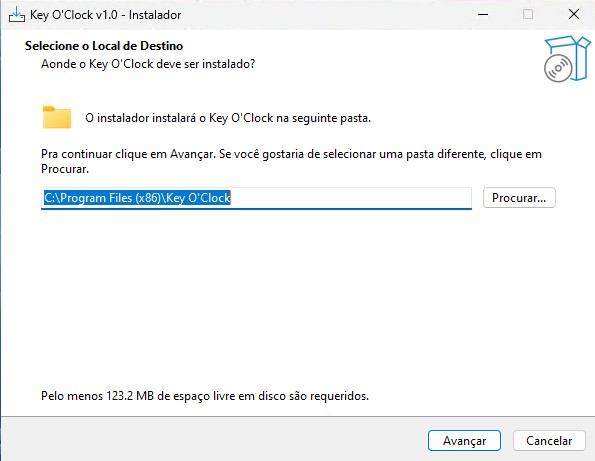
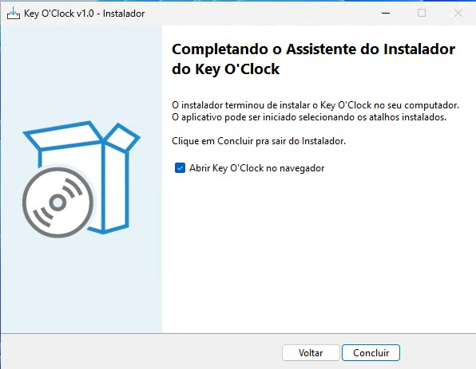

# Instalação

← [Voltar ao índice](./index.md)

---

## Pré-requisitos

### Via instalador Windows
- Windows 10 ou superior (64-bit)
- Conexão com a internet não é necessária após a instalação
- Permissão de administrador (o instalador registra um serviço Windows)

### Via Python (manual)
- Python 3.11 ou superior
- pip

---

## Via Instalador Windows (recomendado)

O instalador `KeyOClock-Setup-x.x.exe` cuida de toda a configuração automaticamente.


*Tela de boas-vindas do instalador Key O'Clock*

**Passos:**

1. Execute `KeyOClock-Setup-x.x.exe` como Administrador
2. Siga o assistente de instalação (próximo → próximo → instalar)
3. O instalador irá:
   - Copiar os arquivos para `C:\Program Files (x86)\Key O'Clock\`
   - Registrar o serviço Windows **KeyOClock** com inicialização automática
   - Configurar o serviço para iniciar em **modo HTTPS**
   - Configurar reinício automático em caso de falha
   - Iniciar o serviço imediatamente
4. Ao final, marque a opção **"Abrir Key O'Clock no navegador"** e clique em Concluir


*Instalação concluída — opção de abrir no navegador*

**Acesso após instalação:**

| Campo | Valor |
|-------|-------|
| URL | `https://localhost:5000` |
| Usuário | `admin` |
| Senha | `admin` |

> **No primeiro login, a troca de senha é obrigatória.** Escolha uma senha segura com no mínimo 8 caracteres.

**Aviso de segurança do navegador (esperado):**

Na primeira vez que abrir o navegador, aparecerá uma tela de aviso de segurança. Isso ocorre porque o serviço usa um **certificado TLS auto-assinado** — o conteúdo é criptografado, mas o navegador não reconhece a autoridade emissora.

Para prosseguir: clique em **Avançado** → **Prosseguir para localhost (não seguro)**.

> Para eliminar o aviso permanentemente, importe um certificado emitido por uma CA confiável via **Configurações → Certificados HTTPS**. Consulte o [Guia de Certificados](./certificados.md) para instruções detalhadas.

---

## Controle do Serviço Windows

O serviço **KeyOClock** inicia automaticamente com o Windows. Para controle manual, abra o **Prompt de Comando como Administrador**:

```cmd
net start KeyOClock
net stop  KeyOClock
```

Ou via Painel de Controle → Ferramentas Administrativas → Serviços → **KeyOClock**.

---

## Localização dos Arquivos

| Arquivo | Caminho |
|---------|---------|
| Executável | `C:\Program Files (x86)\Key O'Clock\keyoclock.exe` |
| Banco de dados | `C:\ProgramData\Key O'Clock\keyoclock.db` |
| Logs | `C:\ProgramData\Key O'Clock\logs\keyoclock.log` |
| Chave de criptografia | `C:\ProgramData\Key O'Clock\.enc_key` ⚠ acesso restrito |
| Certificados TLS | `C:\ProgramData\Key O'Clock\certs\` |

---

## Via Python (manual)

Indicado para desenvolvimento, testes ou sistemas Linux/macOS.

```bash
# 1. Clone ou extraia os arquivos do projeto
cd keyoclock

# 2. Instale as dependências
pip install -r requirements.txt

# 3. Inicie em modo HTTP (desenvolvimento)
python app.py

# Acesse: http://localhost:5000
```

---

## Modo HTTPS

O serviço Windows inicia em **modo HTTPS por padrão** (`https://localhost:5000`). O certificado TLS é auto-assinado e gerado automaticamente na primeira inicialização.

Consulte o [Guia de Certificados](./certificados.md) para entender os tipos de certificado disponíveis e como eliminar o aviso do navegador.

---

### Reverter para HTTP (serviço Windows)

Se necessário, é possível desativar o HTTPS no serviço via Prompt de Comando (Administrador):

```cmd
reg delete "HKLM\SYSTEM\CurrentControlSet\Services\KeyOClock" /v Environment /f
net stop KeyOClock
net start KeyOClock
```

---

### HTTPS na execução Python (manual)

Por padrão, a execução Python inicia em HTTP. Para ativar HTTPS:

**Windows:**
```cmd
start_https.bat
```

**Linux/macOS:**
```bash
HTTPS_MODE=1 python app.py
```

---

## Variáveis de Ambiente

| Variável | Padrão | Descrição |
|----------|--------|-----------|
| `KEYOCLOCK_DATA_DIR` | `./instance/` | Diretório de dados (banco, chaves, certs, logs) |
| `SECRET_KEY` | gerado automaticamente | Chave secreta da sessão Flask |
| `HTTPS_MODE` | não definido | Ativa modo HTTPS com cheroot + TLS |
| `PORT` | `5000` | Porta do servidor |
| `HOST` | `0.0.0.0` | Interface de escuta |
| `DISABLE_SCHEDULER` | não definido | `1` desativa o APScheduler (necessário em multi-worker) |

---

## Produção Linux

```bash
pip install gunicorn

export SECRET_KEY="$(python3 -c 'import secrets; print(secrets.token_hex(32))')"
export KEYOCLOCK_DATA_DIR=/var/lib/keyoclock
export DISABLE_SCHEDULER=1

gunicorn -w 4 -b 0.0.0.0:5000 app:app
```

> **`DISABLE_SCHEDULER=1` é obrigatório com múltiplos workers.** Sem ele, cada worker dispara seus próprios envios e os e-mails chegam duplicados.

---

## Desinstalação (Windows)

Via **Painel de Controle → Programas → Desinstalar um programa → Key O'Clock**.

O desinstalador perguntará se deseja remover os dados da aplicação (banco de dados, logs, configurações e chaves). Responda **Não** para manter os dados em caso de reinstalação.

---

← [Voltar ao índice](./index.md) | [Funcionalidades →](./funcionalidades.md)
