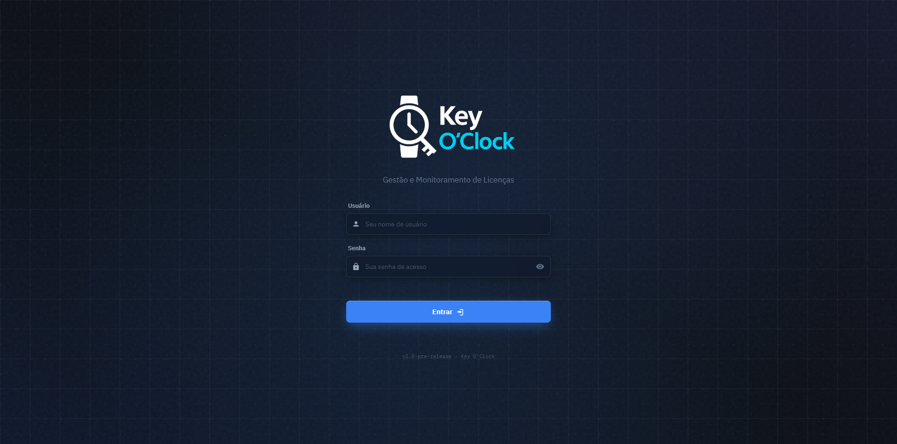
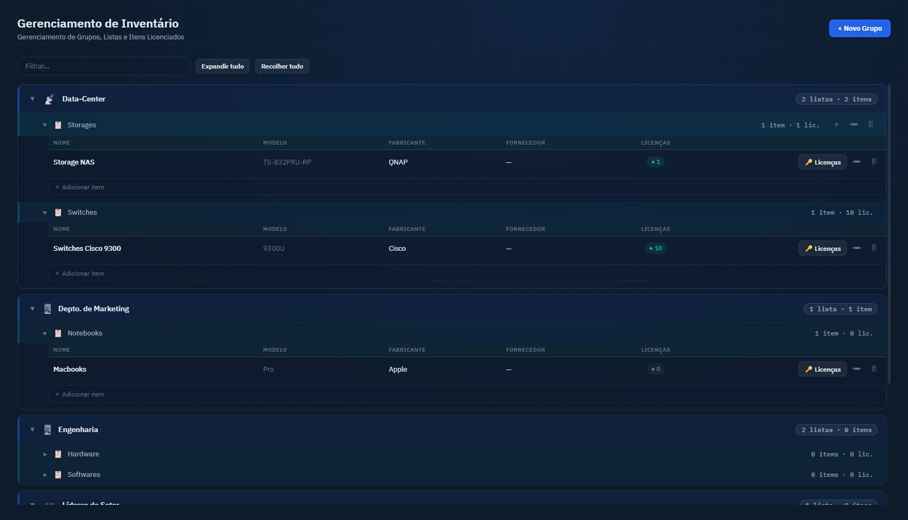
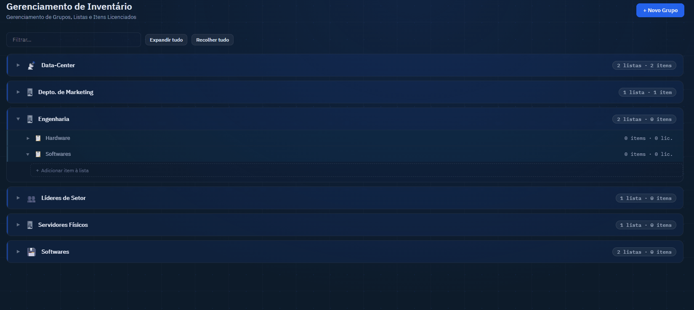
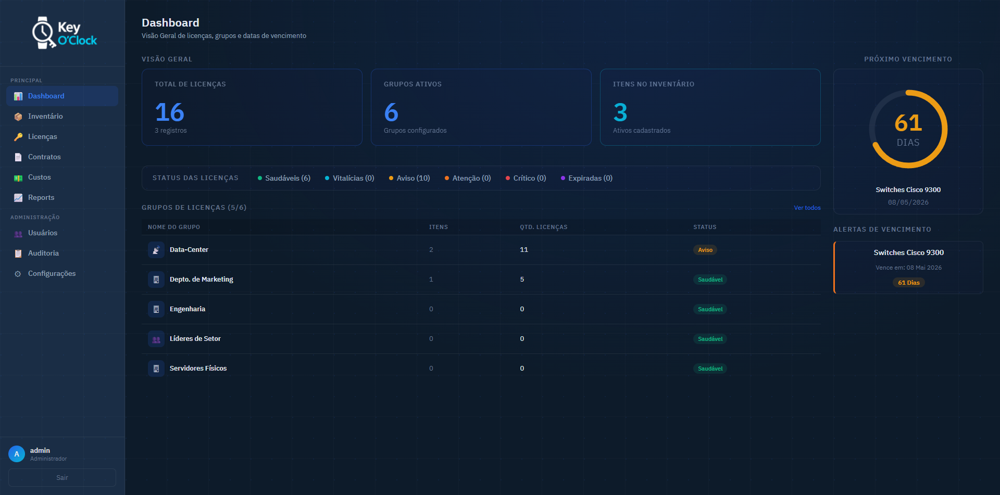
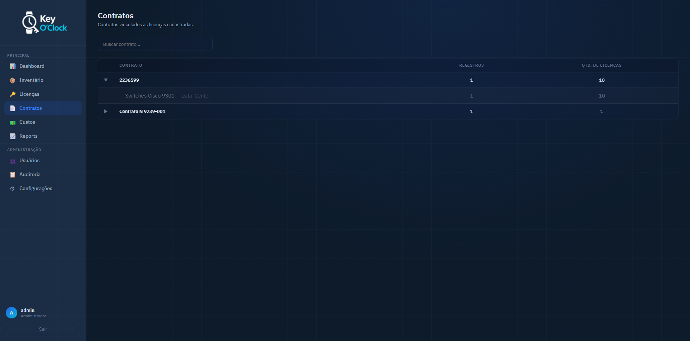
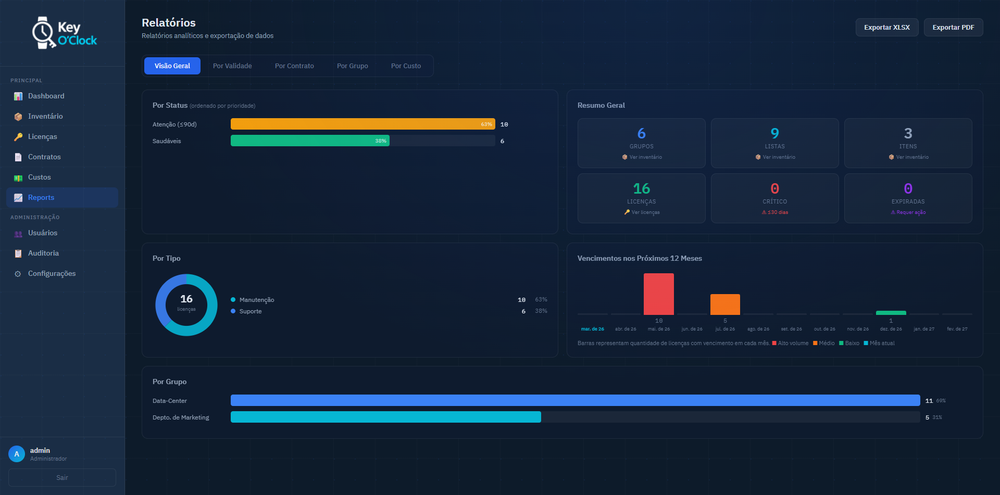
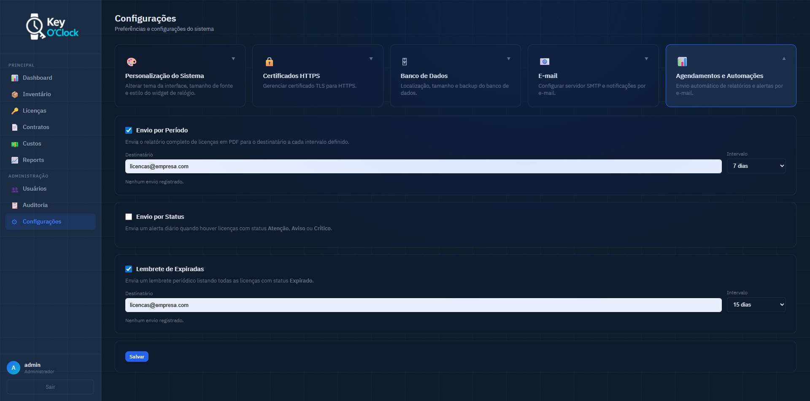

# Guia de Operação

← [Funcionalidades](./funcionalidades.md) | [Voltar ao índice](./index.md) | [Personalização →](./personalizacao.md)

---

## 1. Primeiro Acesso

1. Abra o navegador e acesse `https://localhost:5000`
2. Faça login com as credenciais iniciais:
   - **Usuário:** `admin`
   - **Senha:** `admin`
3. O sistema exibirá um formulário de troca de senha obrigatória


*Tela de login do Key O'Clock*

**Troca de senha obrigatória (primeiro acesso):**

1. Na tela de login, após autenticação, o formulário de nova senha é exibido automaticamente
2. Preencha a nova senha (mínimo 8 caracteres) e confirme
3. Clique em **Definir senha** — o sistema redireciona para o dashboard

---

## 2. Cadastro do Inventário

O inventário deve ser configurado antes do cadastro de licenças, pois cada licença é associada a um item.

**Hierarquia:** `Grupo → Lista → Item`

Exemplo prático:
```
TI (grupo)
└── Servidores (lista)
    ├── SRV-MAIL-01 (item)
    └── SRV-FILE-02 (item)
└── Estações (lista)
    └── WS-FINANCEIRO-01 (item)
└── Software (lista)
    └── Windows (item)
    └── Adobe (item)
```

> Os grupos são livres — podem representar departamentos, filiais, clientes, projetos ou qualquer outra forma de organização que faça sentido para a empresa. Consulte a seção [Inventário em Funcionalidades](./funcionalidades.md#inventário) para exemplos de uso.

### Criar um Grupo

1. Acesse **Inventário** no menu lateral
2. Clique em **+ Novo Grupo**
3. Informe o nome e salve

### Criar uma Lista

1. Dentro do grupo, clique em **+ Nova Lista**
2. Informe o nome e salve

### Criar um Item

1. Dentro da lista, clique em **+ Novo Item**
2. Informe o nome do item (ex: hostname, número de patrimônio)
3. Salve


*Árvore de inventário com grupos, listas e itens expandidos*

---

## 3. Cadastro de Licenças

Com o inventário configurado, associe licenças aos itens.


*Fluxo completo de criação de uma nova licença*

**Passos:**

1. Acesse **Licenças** no menu lateral
2. Clique em **+ Nova Licença**
3. Preencha os campos:

| Campo | Orientação |
|-------|-----------|
| **Item** | Selecione o item do inventário ao qual a licença pertence |
| **Tipo** | Ex: OEM, Volume, Subscrição, Site License |
| **Quantidade** | Número de licenças deste registro (padrão: 1) |
| **Contrato** | Identificador do contrato comercial (opcional) |
| **Data de início** | Data de início da vigência |
| **Data de fim** | Data de vencimento (deixe vazio se for perpétua) |
| **Perpétua** | Marque se a licença não tem prazo de vencimento |
| **Notas** | Informações adicionais (número de série, contato do fornecedor, etc.) |

4. Clique em **Salvar**

O status é calculado automaticamente com base na data de vencimento e atualizado a cada carregamento da página.

---

## 4. Monitoramento via Dashboard

O dashboard é a tela inicial e oferece a visão mais rápida do estado das licenças.


*Dashboard com alerta de licenças críticas*

**O que monitorar:**

- **Cards executivos** — volume total de licenças, grupos e itens
- **Barra de status** — clique em qualquer faixa (ex: "Crítico (3)") para ver somente as licenças daquele status
- **Tabela de grupos** — grupos com licenças críticas aparecem no topo, ordenados por criticidade
- **Widget de próximo vencimento** — exibe quantos dias restam para a licença mais próxima do vencimento

---

## 5. Filtragem e Busca de Licenças

Na página **Licenças**:

- Use o **filtro de status** (dropdown) para ver somente licenças de um status específico
- Use a **busca** (campo de texto) para filtrar por nome do item, divisão ou lista
- Os filtros combinam entre si
- A paginação exibe 50 licenças por página


*Filtro por status "Crítico" com campo de busca*

---

## 6. Visualização de Contratos

Acesse **Contratos** no menu para ver licenças agrupadas por contrato.

- Clique no nome do contrato para expandir e ver os itens associados
- Use o campo de busca para filtrar por nome de contrato
- O painel exibe: número de registros, quantidade total e vencimento mais próximo por contrato


---

## 7. Exportação de Relatórios

Acesse **Relatórios** no menu lateral.


*Abas de relatórios com botões de exportação*

**Navegar pelas abas:**
- **Visão Geral** — gráficos de distribuição por status, tipo e grupo
- **Por Validade** — tabela ordenada por data de vencimento
- **Por Contrato** — cards expansíveis por contrato
- **Por Grupo** — licenças agrupadas por divisão

**Exportar:**
1. Clique em **Exportar XLSX** ou **Exportar PDF**
2. O arquivo é gerado com os dados de todas as abas
3. O campo contrato é descriptografado automaticamente no arquivo exportado

---

## 8. Configuração de Alertas por E-mail

> Requer configuração prévia do SMTP em **Configurações → E-mail** (somente admin).

Acesse **Configurações → Agendamentos**:


*Painel de configuração dos agendamentos de e-mail*

**Configurar envio periódico (relatório PDF):**
1. Informe o e-mail destinatário
2. Defina a frequência em dias (ex: 7 = semanal)
3. Ative o job e salve

**Configurar alerta de status (licenças críticas/atenção/aviso):**
1. Informe o e-mail destinatário
2. Ative o job (o envio ocorre diariamente se houver licenças nessas faixas)
3. Salve

**Configurar lembrete de expiradas:**
1. Informe o e-mail destinatário
2. Defina a frequência em dias
3. Ative o job e salve

---

## 9. Consulta do Log de Auditoria

Acesse **Auditoria** no menu lateral para ver o histórico completo de ações.

- Filtre por data, tipo de ação ou entidade
- Use o campo de busca para localizar registros específicos
- O log é somente leitura e não pode ser alterado pelos usuários

---

← [Funcionalidades](./funcionalidades.md) | [Voltar ao índice](./index.md) | [Personalização →](./personalizacao.md)
