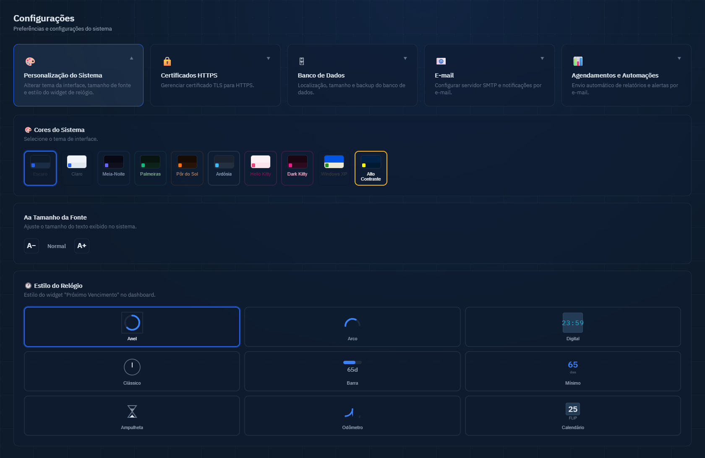

# Personalização

← [Guia de Operação](./operacao.md) | [Voltar ao índice](./index.md) | [Administração →](./administracao.md)

---

As preferências de personalização são **individuais por usuário** e ficam salvas no navegador (`localStorage`). Cada usuário pode ter sua própria configuração sem interferir nos demais.

Para acessar: clique em **Configurações** no menu lateral → **Personalização**.

---

## Temas de Cores

A aplicação oferece 7 temas visuais. A troca é instantânea, sem recarregar a página.

*Os 7 temas disponíveis: Escuro, Claro, Midnight, Sunset, Slate, Windows XP e Alto Contraste*

| Tema | Descrição |
|------|-----------|
| **Escuro** (padrão) | Fundo escuro com acento azul |
| **Claro** | Fundo branco com acento azul |
| **Midnight** | Azul-marinho profundo com acento índigo |
| **Sunset** | Tons quentes com acento laranja |
| **Slate** | Cinza-azulado neutro |
| **Windows XP** | Estilo retrô inspirado no Windows XP clássico |
| **Alto Contraste** | Alto contraste para acessibilidade visual |

**Como trocar:**

1. Acesse **Configurações → Personalização**
2. Clique no tema desejado
3. O tema é aplicado imediatamente e salvo automaticamente

---

## Tamanho de Fonte

Ajuste o tamanho da fonte da interface entre três opções:

| Opção | Indicado para |
|-------|--------------|
| **Pequeno** | Monitores de alta resolução ou preferência por mais conteúdo visível |
| **Normal** (padrão) | Uso geral |
| **Grande** | Monitores menores ou preferência por maior legibilidade |

**Como ajustar:**

1. Acesse **Configurações → Personalização**
2. Clique no tamanho desejado
3. A interface ajusta imediatamente

---

## Estilo do Widget de Vencimento

O widget exibido no dashboard (próximo vencimento) pode ser exibido em 9 estilos visuais diferentes.

*Demonstração dos 9 estilos do widget de próximo vencimento*

| Estilo | Descrição |
|--------|-----------|
| **Anel** (padrão) | Anel circular com progresso proporcional ao tempo restante |
| **Arco** | Arco semicircular com contagem de dias |
| **Barra** | Barra de progresso horizontal |
| **Minimal** | Apenas o número de dias em destaque, sem elementos gráficos |
| **Digital** | Contador estilo display digital (fonte LCD) |
| **Clássico** | Relógio analógico com ponteiro indicando o progresso |
| **Ampulheta** | Ampulheta animada SVG com areia escoando |
| **Odômetro** | Velocímetro/gauge com agulha indicadora |
| **Flip** | Contador estilo flip clock com dígitos animados |

**Como trocar:**

1. Acesse **Configurações → Personalização**
2. Clique no estilo desejado na grade de widgets
3. O dashboard atualiza o widget imediatamente

---

## Persistência das Preferências

As preferências são salvas no `localStorage` do navegador, identificadas pelo prefixo `keyoclock-`:

| Chave | Conteúdo |
|-------|----------|
| `keyoclock-theme` | Tema de cores selecionado |
| `keyoclock-font-size` | Tamanho de fonte selecionado |
| `keyoclock-clock-style` | Estilo do widget de vencimento |

**Implicações:**

- As preferências são por **navegador e dispositivo** — mudar de navegador ou dispositivo redefine para o padrão
- Limpar os dados do navegador (cookies/localStorage) redefine todas as preferências para o padrão
- As preferências não são sincronizadas entre usuários nem armazenadas no servidor

---

← [Guia de Operação](./operacao.md) | [Voltar ao índice](./index.md) | [Administração →](./administracao.md)
